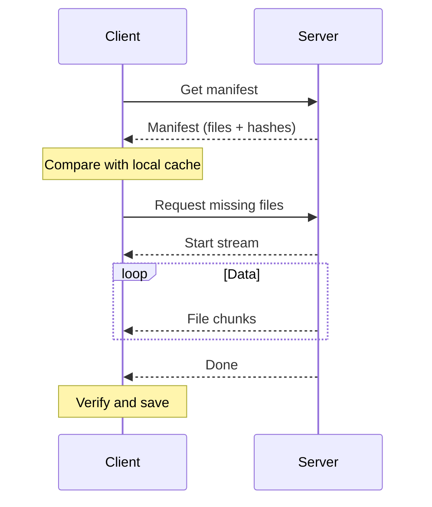

# Resources

Every Moud project is built from two kinds of files: **scene data** (the `.moud.scene` files that describe your node tree) and **resources** (everything else - textures, 3D models, audio clips, scripts, materials, and JSON configs). This guide explains how resources flow from your project folder into a running game.


---

## What "Resources" Means in Moud

In Moud, a **resource** is any file that a node property can reference at runtime. Resources are always addressed by a `res://` path - a virtual path rooted at your project's `assets/` directory.

| Resource kind | Typical extensions | Who consumes it |
|---|---|---|
| Textures / images | `.png`, `.jpg`, `.jpeg`, `.webp` | `MeshInstance3D`, `Model3D`, material files |
| 3D models | `.bbmodel`, `.glb`, `.gltf`, `.obj` | `Model3D` (only `.bbmodel` renders; others accepted for import) |
| Audio clips | `.ogg`, `.wav`, `.mp3` | `AudioPlayer3D`, `AudioPlayer2D` |
| Scripts | `.ts`, `.mts`, `.js`, `.mjs`, `.cjs`, `.luau` | Any node's `script` property |
| Materials | `.moudmat` | Shader / render pipeline |
| Shader sources | `.moudshader`, `.glsl` | Veil render layer |
| JSON configs | `.json` | Project config, scene configs |

---

## The `res://` Path Format

Every asset reference in a node property uses the `res://` prefix:

```
res://textures/hero/idle.png
res://scripts/player_controller.ts
res://audio/sfx/footstep.ogg
res://materials/ground.moudmat
```

The `res://` root maps to the `assets/` subdirectory inside your project root. If your project root is `/srv/mygame`, then `res://textures/hero/idle.png` resolves to `/srv/mygame/assets/textures/hero/idle.png`.

There is also a built-in `moud:` prefix for engine-provided resources:

```
moud:dynamic/white    # a plain white 1×1 texture
```

```hint warning No leading slash after res://
Do **not** include a leading slash after `res://`. Write `res://textures/foo.png`, not `res:///textures/foo.png`.
```

---

```hint tip Do Not Edit Managed Files
The `assets/blobs/` directory and `assets/manifest.tsv` are managed entirely by the engine. Do not edit them by hand.
```

---

## How the Asset System Works

Moud's asset pipeline has two halves:

**Server side (`AssetService` / `FileSystemAssetStore`):**
- Maintains a content-addressed blob store under `assets/blobs/`
- Maintains `assets/manifest.tsv` mapping every `res://` path to a SHA-256 hash and type tag
- Serves the manifest and individual blobs to connected clients on demand
- In dev mode, watches `assets/`, `scripts/`, and `local_scripts/` for file changes (300 ms debounce)

**Client side (`AssetsClient` / `MoudTextAssets`):**
- On connection, immediately requests the full manifest from the server
- Downloads blobs in 256 KB chunks over the `ASSETS` network lane
- Text-format assets are cached by `MoudTextAssets` and made available synchronously after download



---

## Uploading Assets via the Editor

When you drag and drop a file onto the editor overlay (or use the Asset Browser import button), the client:

1. Reads the file from your local filesystem
2. Computes its SHA-256 hash
3. Sends `AssetUploadBegin` to the server
4. If the server responds `ALREADY_PRESENT`, the upload is skipped - deduplication is free
5. Otherwise, streams the file in 256 KB chunks
6. On `AssetUploadComplete` ack, the manifest is refreshed

The maximum upload size is **128 MB** per file.

```hint warning Assets Are Stored Permanently on the Server
Assets uploaded through the editor are stored on the **server** permanently. Use the Delete button in the Asset Browser to remove them - do not delete files from `assets/blobs/` by hand.
```

---

## Referencing Assets in Node Properties

### In the Inspector

Click any property field with a folder icon. The editor opens an asset picker filtered to compatible types. Select a file and the path is written as `res://path/to/file.ext`.


### From a Script

````tabs
--- tab: TypeScript
```typescript
import { Node3D, ready } from "moud";

export default class AssetRefs extends Node3D {
  @ready()
  onReady() {
    // Set a texture on a MeshInstance3D
    this.set("texture", "res://textures/hero/idle.png");

    // Reference an audio clip
    this.set("sound_id", "res://audio/sfx/footstep.ogg");

    // Change the model on a Model3D node
    this.set("model", "res://models/hero.bbmodel");

    // Apply a material
    this.set("material", "res://materials/ground.moudmat");
  }
}
```

--- tab: JavaScript
```js
({
  _ready(api) {
    // Set a texture on a MeshInstance3D
    api.set("texture", "res://textures/hero/idle.png");

    // Reference an audio clip
    api.set("sound_id", "res://audio/sfx/footstep.ogg");

    // Change the model on a Model3D node
    api.set("model", "res://models/hero.bbmodel");

    // Apply a material
    api.set("material", "res://materials/ground.moudmat");
  }
})
```

--- tab: Luau
```lua
local script = {}
function script:_ready(api)
  -- Set a texture on a MeshInstance3D
  api:set("texture", "res://textures/hero/idle.png")

  -- Reference an audio clip
  api:set("sound_id", "res://audio/sfx/footstep.ogg")

  -- Change the model on a Model3D node
  api:set("model", "res://models/hero.bbmodel")

  -- Apply a material
  api:set("material", "res://materials/ground.moudmat")
end
return script
```

--- tab: Java
```java
import com.moud.server.minestom.scripting.java.NodeScript;

public final class AssetRefs extends NodeScript {
    @Override public void onReady() {
        long self = core.id();

        // Set a texture on a MeshInstance3D
        core.set(self, "texture", "res://textures/hero/idle.png");

        // Reference an audio clip
        core.set(self, "sound_id", "res://audio/sfx/footstep.ogg");

        // Change the model on a Model3D node
        core.set(self, "model", "res://models/hero.bbmodel");

        // Apply a material
        core.set(self, "material", "res://materials/ground.moudmat");
    }
}
```
````

```hint info Property Changes Replicate Immediately
Property changes via `api.set()` replicate to all connected clients immediately. The client downloads the referenced blob automatically if it does not already have it cached.
```

---

## The Asset Manifest

`assets/manifest.tsv` is a tab-separated file:

```
res://textures/hero/idle.png	a3f4c2...	81920	IMAGE
res://audio/sfx/footstep.ogg	b7e1d9...	24576	BINARY
res://scripts/player.ts	c1a5f3...	2048	TEXT
```

Columns: `res:// path`, `sha256 hex`, `size in bytes`, `asset type`.

The engine regenerates this file on every upload, deletion, and hot-reload event. It is safe to commit to version control.

```hint danger Do Not Edit manifest.tsv Manually
Do not edit `manifest.tsv` manually. An inconsistent manifest - a path mapped to a missing blob - causes download failures for clients and may crash asset-dependent rendering.
```

### Asset Type Tags

| Type | Meaning |
|---|---|
| `TEXT` | UTF-8 text - scripts, materials, shaders, JSON |
| `BINARY` | Raw bytes - models, audio, scene snapshots |
| `IMAGE` | Pixel data - `.png`, `.jpg`, `.jpeg` |
